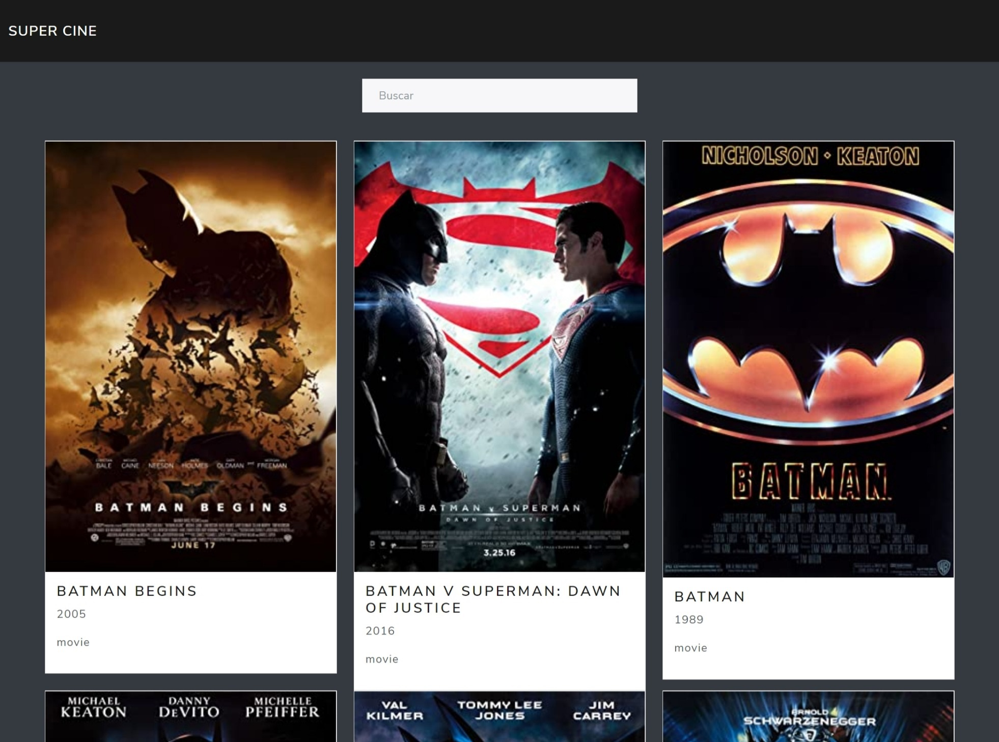

# Description

Is a React App to find information about movies and series from a RESTful API (OMDB).

> learning app

application created without using `create-react-app` to learn npm package.

## Screenshots



## npm Packages

### dependencies

- `webpack` : Empaqueta archivos para su uso en un navegador.
- `webpack-cli` : Comandos para configurar webpack en (cli).
- `@babel/core` : Transforma código moderno React a código enfocado en el navegador.
- `@babel/preset-env` : Permite usar el último JS sin necesidad de microgestionar transformaciones de sintaxis por cada entorno de destino.
- `@babel/preset-react` : Entender jsx.
- `babel-loader` : Integra con webpack.
- `html-webpack-plugin` : Copiar html de desarrollo a producción.
- `react` : React.
- `react-dom`: Manipular el (dom) document object model, del navegador.
- `webpack-dev-server`: Servidor de desarrollo local.
- `bootswatch` : Estilos CSS.
- `css-loader` : Convertir el css importado dentro del js.
- `style-loader` : Cargar los estilos convertidos en el DOM.
- `prop-types` : Verificación de variables de react. o Flow o TypeScript.

### devDependencies

- `dotenv-webpack` : Variables de entorno con webpack.
- `eslint`: Revisa código Ej: falta de variables de entorno.
- `eslint-webpack-plugin`: Integración con webpack verificar al ejecutar.
- `eslint-plugin-react`: Analiza código jsx.
- `dotenv-webpack`: Variables de entorno.

### Install Package

```bash
npm install
```

## npm Scripts

- `npm start` : "webpack serve --mode development --open",
- `npm run production` : "webpack --mode production"

## API

[OMDB API KEY](http://www.omdbapi.com/)

---

### 📝 License

This project is available under the **"The Unlicense".** See the [LICENSE](LICENSE) file for more information.

### 🌐 Based on

[React sin create-react-app | Aplicación de Series y Peliculas con OMDB](https://youtu.be/SJwWQATQGvc)
